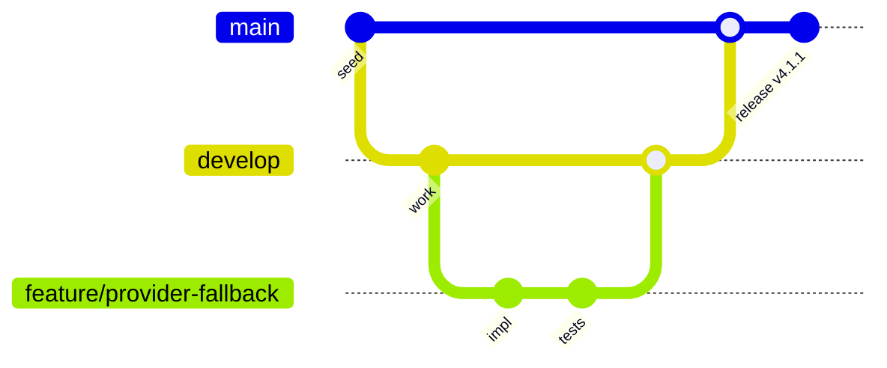

# Contributing to GenAI Browser Tool

<div align="center">


[Quick Start](#quick-start) • [Dev Setup](#development-setup) • [Commit Rules](#commit-guidelines) • [Code Style](#code-style-guidelines) • [Testing](#testing-requirements) • [PR Process](#pull-request-workflow)

</div>

## Table of Contents

<details>
<summary>Expand</summary>

- [Quick Start](#quick-start)
- [Development Setup](#development-setup)
- [Project Structure](#project-structure)
- [Branching Model](#branching-model)
- [Commit Guidelines](#commit-guidelines)
- [Code Style Guidelines](#code-style-guidelines)
- [Security & Privacy](#security--privacy)
- [Testing Requirements](#testing-requirements)
- [Pull Request Workflow](#pull-request-workflow)
- [Review Process](#review-process)
- [Release Process](#release-process)
- [Issue Triage](#issue-triage)
- [Community Expectations](#community-expectations)

</details>

## Quick Start

1. Fork the repo and create your branch from `main`:
   ```bash
   git clone https://github.com/YOUR_USERNAME/GenAI-Browser-Tool
   cd GenAI-Browser-Tool
   git checkout -b feature/awesome-change
   ```
2. Install dependencies and prepare hooks:
   ```bash
   npm ci
   npm run prepare
   ```
3. Run in development mode:
   ```bash
   npm run dev:extension
   ```
4. Load the unpacked extension from the project root at `chrome://extensions`.
5. Write tests and ensure all checks pass (see below), then open a PR.

## Development Setup

### Prerequisites
- Node.js >= 18, npm >= 9
- Chrome/Edge >= 88 (for MV3), Firefox (limited MV3)
- Git, VS Code (recommended)

### Environment configuration
```bash
cp .env.example .env
# Configure provider keys as needed (also configurable in Options UI)
```

### Common scripts
```bash
npm run dev:extension   # Watch build for extension
npm run build:extension # Production build (Rollup MV3 bundle)
npm run test            # Unit tests (Vitest)
npm run test:e2e        # Playwright E2E
npm run lint            # ESLint + security rules
npm run typecheck       # TypeScript type checks
npm run format          # Prettier formatting
```

## Project Structure

```
GenAI-Browser-Tool/
├── background.js          # MV3 service worker
├── content.js             # content script injected in pages
├── popup.html/css/js      # popup UI
├── options.html/css/js    # settings UI
├── core/                  # core orchestration
│   ├── ai-provider-orchestrator.js
│   └── configuration-manager.js
├── providers/             # AI provider adapters
│   ├── openai-provider.js
│   ├── claude-provider.js         (add as needed)
│   ├── gemini-provider.js         (add as needed)
│   └── chrome-ai-provider.js      (add as needed)
├── services/              # utilities: cache, security, extractors
├── utils/                 # helpers
├── tests/                 # unit/e2e tests
├── docs/                  # additional docs
└── manifest.json          # MV3 manifest
```

## Branching Model

We use a simplified Git Flow tailored for extensions:



- `main`: stable, released code (protected)
- `develop`: integration branch for next release
- `feature/*`, `fix/*`, `docs/*`, `chore/*` short‑lived branches

## Commit Guidelines

Follow Conventional Commits. Examples:

```
feat(provider): add Gemini fallback when OpenAI is rate-limited
fix(content): sanitize HTML before summarization to avoid XSS
perf(cache): memoize provider health checks
docs(readme): add manual install steps for Firefox
chore(ci): add CodeQL security scan
```

Rules:
- Imperative mood, max 50 chars subject, no trailing period
- Optional body wraps at 72 cols; explain motivation, approach, tradeoffs
- Reference issues: `Closes #123`, `Refs #456`
- Breaking changes in footer: `BREAKING CHANGE: ...`

## Code Style Guidelines

### JavaScript/TypeScript
- Use TypeScript types in new/changed files when possible
- Prefer pure functions, avoid side effects in providers/services
- Strict input validation (zod/validators) and output typing
- No direct DOM injection; sanitize with DOMPurify before rendering
- Avoid long functions (>40 lines). Extract helpers.

Example patterns:
```ts
// Typed provider request
export interface AIRequest { kind: 'summary'|'qa'|'translate'|'analyze'; text: string; locale?: string; }
export interface AIResponse { content: string; tokens?: number; latencyMs?: number; sources?: string[] }

export async function summarize(req: AIRequest): Promise<AIResponse> {
  if (req.kind !== 'summary') throw new Error('invalid kind');
  // ... impl
  return { content: result.text, tokens: result.usage?.total_tokens };
}
```

### UI/UX
- Keep popup UI responsive and accessible (ARIA labels, tab order)
- Respect prefers-color-scheme; ensure contrast and keyboard navigation
- No blocking operations on UI thread; use async boundaries and spinners

### Security & Privacy
- Do not log API keys or user content
- Use `chrome.storage.sync/local` with minimal retention; encrypt secrets
- Enforce CSP in manifest; never eval or inline scripts
- Strip PII before sending to external APIs where feasible

## Security & Privacy

All contributions must comply with:
- Manifest V3 policies (no remote code, background service worker)
- Chrome Web Store / Edge Add-ons policies
- Minimum-permission principle

Checklist before PR:
- [ ] No secrets in code or history
- [ ] Inputs validated and sanitized
- [ ] External requests over HTTPS with proper hosts
- [ ] Respect user opt-outs and incognito isolation

## Testing Requirements

Coverage targets (guideline, not hard fail):
- Unit: ≥ 80% lines on changed modules
- E2E: happy paths for popup, summary, Q&A, translate

Examples:
```ts
// Vitest unit example
import { describe, it, expect } from 'vitest';
import { sanitize } from '@/services/security-manager';

describe('security', () => {
  it('removes scripts from HTML', () => {
    expect(sanitize('')).not.toMatch(/onerror/);
  });
});
```

```ts
// Playwright e2e snippet
import { test, expect } from '@playwright/test';

test('popup opens and summarizes page', async ({ page }) => {
  await page.goto('https://example.com');
  // open extension UI per your test harness
  await expect(page.locator('.genai-popup')).toBeVisible();
  await page.click('#summarize');
  await expect(page.locator('.summary-result')).toHaveText(/summary/i, { timeout: 10000 });
});
```

CI checks must pass: lint, typecheck, unit, e2e (where configured).

## Pull Request Workflow

Pre‑flight:
- [ ] Lint, typecheck, tests pass locally
- [ ] Updated README/docs for user‑facing changes
- [ ] Added/updated tests
- [ ] No bundle bloat (verify `dist/` size delta)

PR Description Template:
```markdown
## Summary
What changed and why.

## Changes
- ...

## Tests
- Unit:
- E2E:

## Screenshots
(If UI changed)

## Risks & Rollback
Potential impact and how to revert.

## Related
Closes #123, Refs #456
```

Labels:
- `bug`, `enhancement`, `documentation`, `dependencies`, `security`, `breaking change`, `good first issue`

## Review Process

For reviewers:
- Focus on correctness, security, privacy, and maintainability
- Suggest concrete improvements; prefer questions over directives
- Approve if concerns are addressed even if further polish is possible

For authors:
- Respond to all comments
- Keep commits clean (squash before merge unless history is valuable)
- Provide benchmarks when touching performance‑critical paths

## Release Process

We use SemVer and align `manifest.json` version with `package.json`.

Steps:
1. Update versions: `npm version patch|minor|major`
2. Update CHANGELOG.md
3. Build and smoke test: `npm run build:extension`
4. Tag and push: `git push --follow-tags`
5. Create GitHub release
6. Submit to Chrome Web Store / Edge Add‑ons

## Issue Triage

Triage labels we use:
- `needs repro`, `blocked`, `security`, `performance`, `help wanted`, `good first issue`

When filing a bug, include:
- Repro steps, expected vs actual, console logs (redacted), browser version, OS, extension version.

## Community Expectations

- Be kind, be specific, be constructive.
- Follow our [Code of Conduct](CODE_OF_CONDUCT.md).
- Respect privacy and ethical AI usage in proposals and code.

---

Thank you for contributing to GenAI Browser Tool. Your improvements help thousands browse smarter and safer.