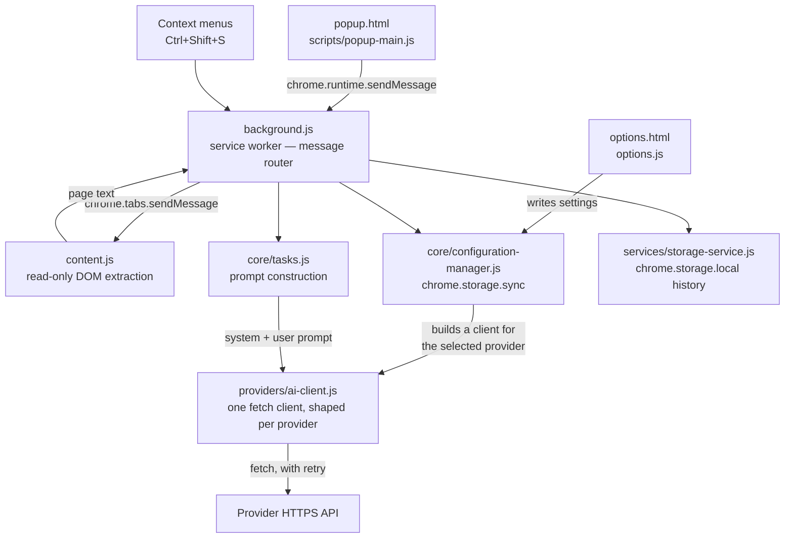
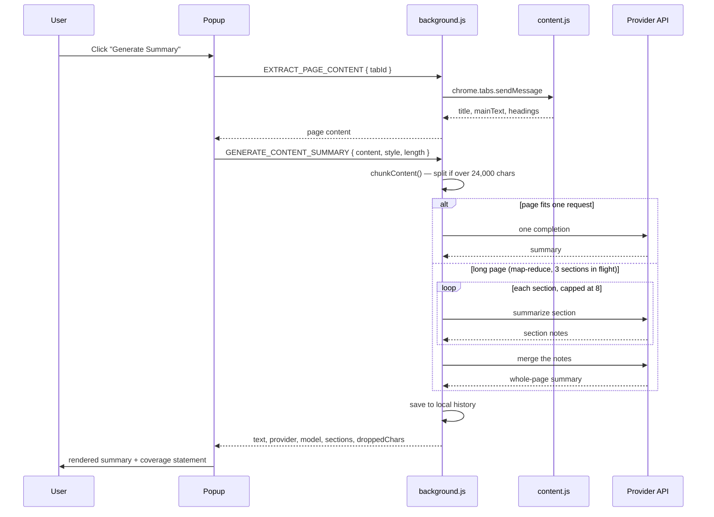

# Development Guide

This guide provides detailed information for developers working on the GenAI Browser Tool extension.

## Architecture Overview

Every AI call originates in the service worker. The popup and the options page
never talk to a provider, and the content script has no network access at all —
so there is exactly one place where a request can be shaped, retried, or leak a
key.



### Request lifecycle: one summary



A failure at any provider step is returned with its own message and an error
code (`MISSING_API_KEY`, `AUTH_ERROR`, `TIMEOUT`, …). Nothing degrades into a
plausible-looking fake result, and a section that fails after retries fails the
whole summary rather than producing a partial one presented as complete.

## Core Components

### Background Service Worker

**File**: `background.js`  
**Purpose**: Central coordination hub for extension functionality

**Key Responsibilities**:
- AI provider orchestration and fallback handling
- Context menu registration and event handling
- Message routing between components
- Storage management and data persistence
- Error handling and logging
- Performance analytics tracking

**Key Classes**:
- `BackgroundServiceOrchestrator`: Main service coordinator
- `AIProviderOrchestrator`: Manages multiple AI providers
- `ConfigurationManager`: Handles user preferences
- `StorageService`: Data persistence layer
- `NotificationManager`: User notification system

### Content Scripts

**File**: `content.js`  
**Purpose**: Interact with web page content and DOM

**Key Responsibilities**:
- Extract page content (text, metadata, structure)
- Read the current selection, links, and images on request

It is read-only by design: it never modifies the page, injects no UI, and has no
network access of its own. Stripping of navigation and ads happens on a clone, so
the page the user is looking at is untouched.

### Popup Interface

**Files**: `popup.html`, `scripts/popup-main.js`, `styles/popup.css`  
**Purpose**: Main user interface for extension

**Key Features**:
- Content summarization controls
- Q&A interface
- Translation tools
- Settings access
- History and saved items

### Options Page

**Files**: `options.html`, `options.js`, `options.css`  
**Purpose**: Extension configuration and preferences

**Key Features**:
- AI provider configuration
- API key management
- Customization options
- Export/import settings

## AI Provider System

### Provider Architecture

The extension supports multiple AI providers through a unified interface:

```javascript
class AIProvider {
  async initialize() { /* Provider-specific setup */ }
  async generateSummary(content, options) { /* Summarization */ }
  async answerQuestion(question, context) { /* Q&A */ }
  async translateText(text, targetLang) { /* Translation */ }
  async analyzeSentiment(text) { /* Sentiment analysis */ }
}
```

### Supported Providers

1. **OpenAI GPT**
   - Models: GPT-4, GPT-3.5-turbo
   - Features: Summarization, Q&A, analysis
   - Rate limits: Configurable

2. **Anthropic Claude**
   - Models: Claude-3 Sonnet, Haiku
   - Features: Long-form analysis, reasoning
   - Context length: Up to 200K tokens

3. **Google Gemini**
   - Models: Gemini Pro, Gemini Pro Vision
   - Features: Multimodal processing
   - Integration: Direct API

4. **Chrome Built-in AI** (Future)
   - Model: Gemini Nano
   - Features: Local processing
   - Privacy: No data leaves device

### Provider Selection Logic

```javascript
class AIProviderOrchestrator {
  async getOptimalProvider(task) {
    // 1. Check user preference
    // 2. Validate API availability
    // 3. Consider task requirements
    // 4. Implement fallback logic
    // 5. Return best available provider
  }
}
```

## Message Passing System

### Message Structure

```javascript
const message = {
  actionType: 'GENERATE_CONTENT_SUMMARY',
  requestId: 'unique-request-id',
  payload: {
    content: 'Content to process',
    options: { /* Task-specific options */ }
  }
};
```

### Supported Actions

- `GENERATE_CONTENT_SUMMARY`: Content summarization
- `ANSWER_CONTEXTUAL_QUESTION`: Q&A processing
- `TRANSLATE_CONTENT`: Text translation
- `ANALYZE_SENTIMENT`: Sentiment analysis
- `EXTRACT_PAGE_CONTENT`: DOM content extraction
- `SAVE_SMART_BOOKMARK`: Intelligent bookmarking
- `GET_USER_PREFERENCES`: Configuration retrieval
- `UPDATE_USER_PREFERENCES`: Settings update

### Error Handling

```javascript
const response = {
  success: false,
  error: 'Descriptive error message',
  errorCode: 'ERROR_CODE',
  requestId: 'matching-request-id',
  processingTime: 1250
};
```

## Storage System

### Data Structure

```javascript
const storageSchema = {
  // User preferences
  userPreferences: {
    aiProvider: 'openai',
    summaryLength: 'medium',
    language: 'en',
    theme: 'auto'
  },
  
  // Summary history
  summaryHistory: [
    {
      id: 'unique-id',
      originalContent: 'excerpt...',
      summary: 'Generated summary',
      timestamp: 1699123456789,
      provider: 'openai',
      options: { /* summarization options */ }
    }
  ],
  
  // Conversation history
  conversationHistory: [
    {
      question: 'User question',
      answer: 'AI response',
      context: 'Page context',
      timestamp: 1699123456789
    }
  ]
};
```

Settings are **not** here. They live in `chrome.storage.sync` under a single
`user_preferences` key, behind `core/configuration-manager.js`, which is their
only reader and writer. A `smartBookmarks` list was documented here until 5.2.0
and never existed in any reachable form.

### Storage Management

- **Chrome Storage API**: Persistent data storage
- **Quota Management**: 5MB limit handling
- **Data Cleanup**: Automatic old data removal
- **Sync Support**: Cross-device synchronization

## Security Model

### Input Validation

```javascript
class SecurityValidator {
  validateMessage(message, sender) {
    // Validate message structure
    // Check sender permissions
    // Verify action type
    // Sanitize payload data
  }
  
  sanitizeHtml(htmlContent) {
    // Use DOMPurify for HTML sanitization
    // Remove script tags and dangerous attributes
    // Preserve safe formatting
  }
  
  validateApiKey(provider, key) {
    // Check key format and length
    // Validate against provider patterns
    // Ensure key is not exposed
  }
}
```

### Content Security Policy

```json
{
  "content_security_policy": {
    "extension_pages": "script-src 'self'; object-src 'self'; style-src 'self' 'unsafe-inline'; connect-src 'self' https://api.openai.com https://api.anthropic.com https://generativelanguage.googleapis.com;"
  }
}
```

### API Key Security

- **Encrypted Storage**: API keys encrypted at rest
- **Memory Protection**: Keys cleared after use
- **Transmission Security**: HTTPS-only communication
- **Access Control**: Restricted to authorized contexts

## Performance Optimization

### Bundle Optimization

- **Tree Shaking**: Remove unused code
- **Code Splitting**: Lazy load components
- **Minification**: Compress production builds
- **Source Maps**: Debug-friendly development

### Runtime Performance

```javascript
class PerformanceTracker {
  trackActionPerformance(action, duration) {
    // Log performance metrics
    // Identify slow operations
    // Generate optimization recommendations
  }
  
  monitorMemoryUsage() {
    // Track memory consumption
    // Detect memory leaks
    // Implement cleanup strategies
  }
}
```

### Caching

There is none. No response cache, no content cache, no TTL layer. Every AI action
issues a fresh request.

This is a deliberate gap rather than an oversight: summaries are cheap to re-run,
pages change under the same URL, and a stale summary presented as current is a
worse failure than paying for a second request. Adding one would mean deciding
what invalidates an entry, which is tracked as future work rather than assumed.

## Testing Strategy

### Unit Testing

```javascript
// tests/providers/ai-client.test.js
describe('AIClient', () => {
  it('reports a missing API key with a code the UI can branch on', () => {
    expect(() => new AIClient({ provider: 'anthropic', apiKey: '' }))
      .toThrow(/options page/i);
  });
});
```

Tests mock `global.fetch` (set up in `tests/setup.js`) — no test ever reaches a
real provider. `tests/integration/extension-workflow.test.js` imports
`background.js`, captures the registered `chrome.runtime.onMessage` listener, and
drives complete request/response cycles through it.

### E2E Testing

```javascript
// Extension loading test
test('should load extension', async ({ page, context }) => {
  await page.goto('https://example.com');
  const serviceWorkers = await context.serviceWorkers();
  expect(serviceWorkers.length).toBeGreaterThan(0);
});
```

### Testing Tools

- **Vitest**: Unit and integration testing
- **Playwright**: E2E browser testing
- **Chrome DevTools**: Performance profiling
- **Coverage Reports**: Code coverage analysis

## Build System

**There is no build step**, for development or for packaging. Load the
repository root as an unpacked extension; `manifest.json` points at the source
files and Chrome loads ES modules natively in MV3 service workers. After editing,
hit **Reload** on `chrome://extensions`.

```bash
npm run verify   # lint + typecheck + test — run this before a PR
```

A Rollup config existed until 5.2.0 and was removed: CI built `dist/` and then
excluded it from the packaged zip, so nothing ever consumed the output.

- **Packaging**: zip the repository root with `node_modules/`, `tests/`, `docs/`,
  and the config files excluded. The CI `package` job does exactly this and
  uploads the result as an artifact.
- **TypeScript**: type checking of JavaScript via JSDoc (`checkJs: true`). No
  `.ts` source files. `npm run typecheck` must report zero errors.

## Deployment

### Chrome Web Store

The extension is **not published**. It is installed unpacked. If that changes,
the store listing needs icons, screenshots, and a privacy justification for the
`host_permissions` entries; the packaged zip is already produced by CI.

### Development installation

1. Clone the repository
2. `npm ci` (Node 20.19 or newer)
3. `chrome://extensions` → Developer mode → **Load unpacked** → repository root
4. Add a provider API key on the options page, which opens on first install

## Troubleshooting

### Common Issues

**Extension won't load**
- Check manifest.json syntax
- Verify file paths
- Review console errors

**API calls failing**
- Validate API keys
- Check network connectivity
- Review rate limits

**Performance issues**
- Profile memory usage
- Analyze bundle size
- Review caching strategy

### Debugging Tools

- **Chrome DevTools**: Extension inspection
- **Extension DevTools**: Service worker debugging
- **Network Panel**: API call monitoring
- **Performance Panel**: Runtime profiling

## Contributing

See [CONTRIBUTING.md](../CONTRIBUTING.md) for detailed contribution guidelines.

## Resources

- [Chrome Extension Documentation](https://developer.chrome.com/docs/extensions/)
- [Manifest V3 Migration Guide](https://developer.chrome.com/docs/extensions/migrating/)
- [Web Extension APIs](https://developer.mozilla.org/en-US/docs/Mozilla/Add-ons/WebExtensions)
- [AI Provider Documentation](docs/AI_PROVIDERS.md)